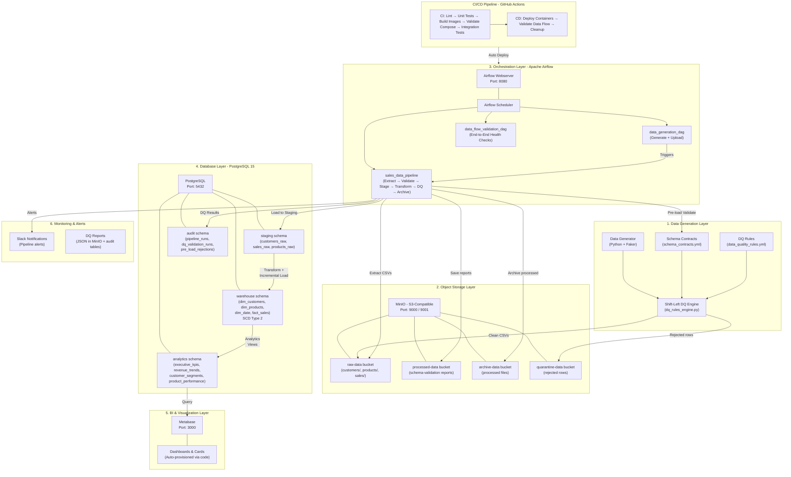

# Customer Data Platform — Architecture

## High-Level Architecture Diagram



## Data Flow Summary

```
Data Generator (Faker)
    │
    ▼
Shift-Left DQ Engine ──→ quarantine-data bucket (rejected rows)
    │
    ▼ (clean CSVs)
MinIO raw-data bucket
    │
    ▼ (Airflow sales_data_pipeline)
┌─────────────────────────────────────────────────┐
│  1. Extract CSVs from MinIO                     │
│  2. Pre-load schema & data validation           │
│  3. Load clean rows → staging schema            │
│  4. Transform → warehouse (SCD Type 2)          │
│  5. Apply analytics views                       │
│  6. Run post-load DQ checks                     │
│  7. Archive processed files → archive-data      │
│  8. Send Slack notifications                    │
└─────────────────────────────────────────────────┘
    │
    ▼
PostgreSQL (staging → warehouse → analytics)
    │
    ▼
Metabase Dashboards (auto-provisioned)
```

## Technology Stack

| Layer | Component | Technology | Port |
|-------|-----------|------------|------|
| Data Generation | Sample data + DQ validation | Python 3.11, Faker | — |
| Object Storage | Raw/processed/archive files | MinIO (S3-compatible) | 9000, 9001 |
| Orchestration | DAG scheduling & ETL | Apache Airflow 2.8 | 8080 |
| Database | Staging, warehouse, analytics, audit | PostgreSQL 15 | 5432 |
| BI & Dashboards | Visualization & exploration | Metabase | 3000 |
| Containerization | Service lifecycle | Docker Compose | — |
| CI/CD | Automated build, test, deploy | GitHub Actions | — |
| Alerts | Pipeline notifications | Slack Webhooks | — |

## Database Schemas

| Schema | Purpose | Key Tables/Views |
|--------|---------|------------------|
| `staging` | Raw data landing zone | `customers_raw`, `sales_raw`, `products_raw` |
| `warehouse` | Curated dimensions & facts (SCD Type 2) | `dim_customers`, `dim_products`, `dim_date`, `fact_sales` |
| `analytics` | Business-ready views | `executive_kpis`, `revenue_profit_trends`, `customer_segments`, `product_performance` |
| `audit` | Pipeline & DQ tracking | `pipeline_runs`, `dq_validation_runs`, `pre_load_rejections` |

## CI/CD Pipeline

### CI (Continuous Integration)
1. **Lint** — flake8, black, isort
2. **Unit Tests** — pytest with coverage
3. **Build Docker Images** — airflow, data-generator
4. **Validate Compose** — config syntax + service definitions
5. **Integration Tests** — end-to-end mocked tests

### CD (Continuous Deployment)
1. **Deploy Services** — build images, start all containers, health checks
2. **Validate Data Flow** — run data generator, trigger pipeline, verify storage, check Metabase
3. **Cleanup** — tear down containers and volumes

## Docker Services

| Service | Container Name | Image | Purpose |
|---------|---------------|-------|---------|
| postgres | cdp-postgres | postgres:15-alpine | Data warehouse |
| minio | cdp-minio | minio/minio:latest | Object storage |
| minio-init | cdp-minio-init | minio/mc:latest | Bucket initialization |
| airflow-init | cdp-airflow-init | Custom (Dockerfile) | DB init + user creation |
| airflow-webserver | cdp-airflow-webserver | Custom (Dockerfile) | Airflow UI |
| airflow-scheduler | cdp-airflow-scheduler | Custom (Dockerfile) | DAG scheduling |
| metabase | cdp-metabase | metabase/metabase:latest | BI dashboards |
| data-generator | cdp-data-generator | Custom (Dockerfile) | Sample data generation |
